# Tugas api_vania_paml

Customer
1. Create
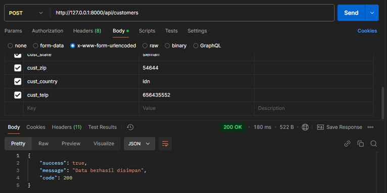
2. Reed 
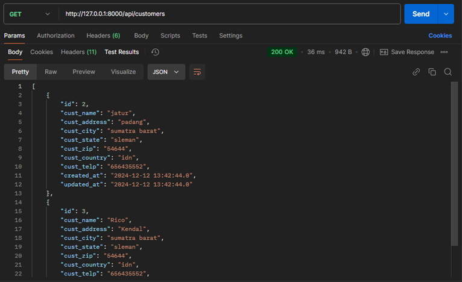
3. Update 
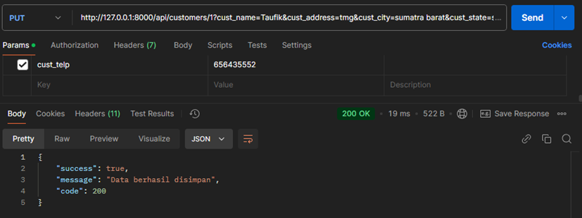
4. Delete
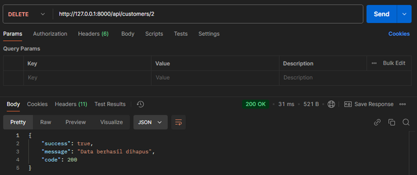

Vendors
1. Create
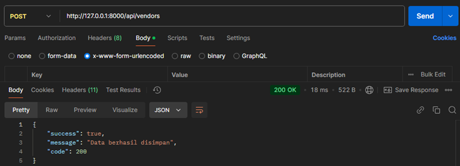
2. Reed 
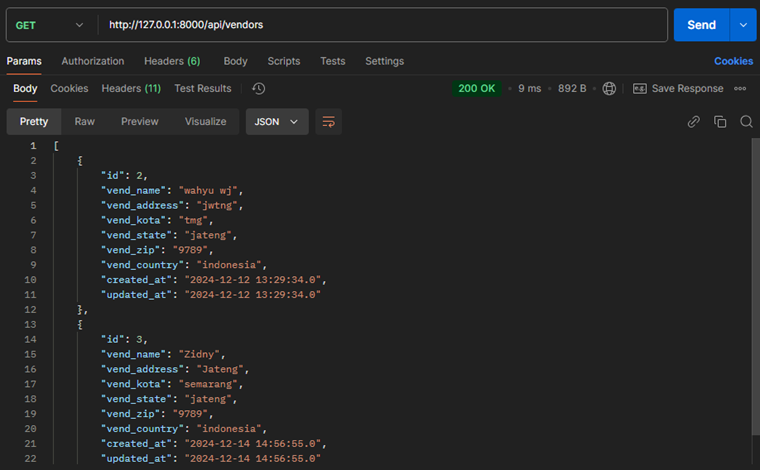
3. Update
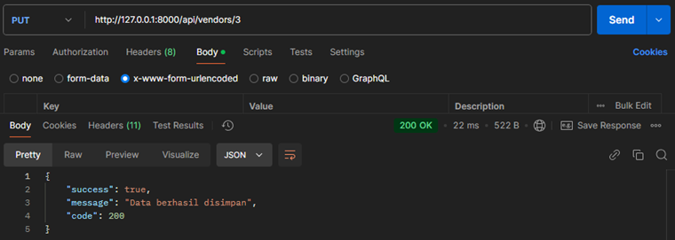
4. Delete
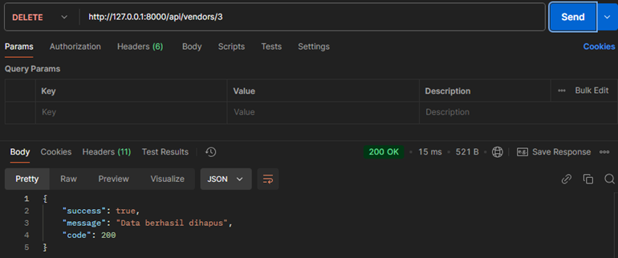

Product
1. Create 
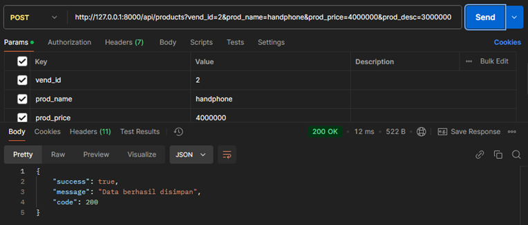
2. Reed 
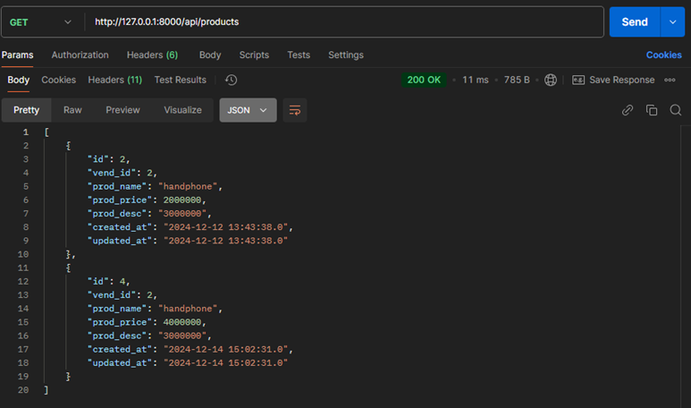
3. Update
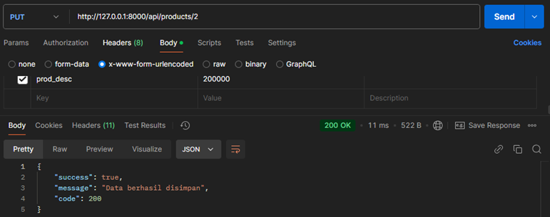
4. Delete
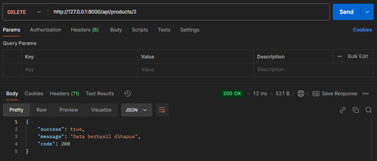

Auth
1. Register
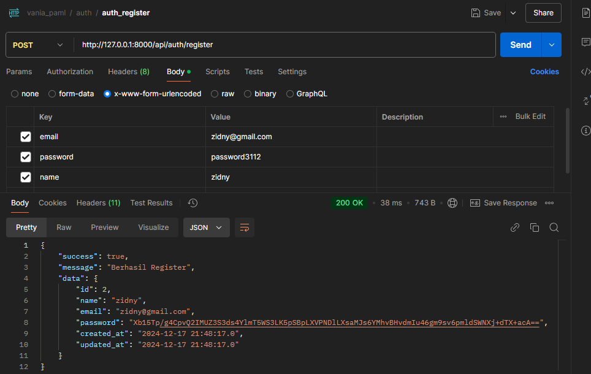
2. Login
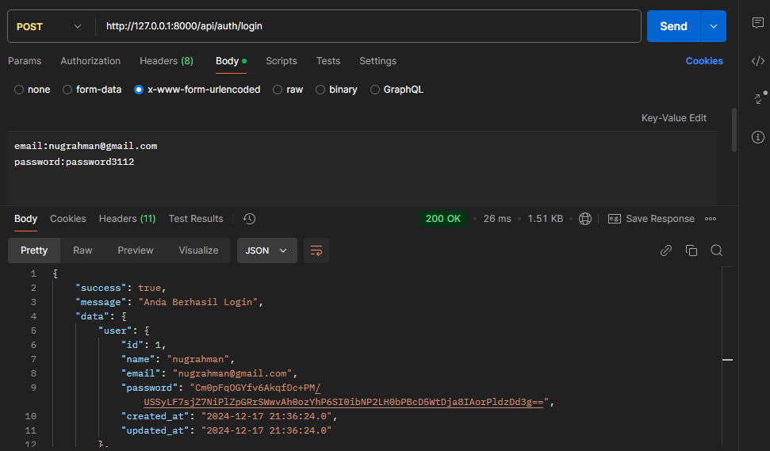
3. Logout
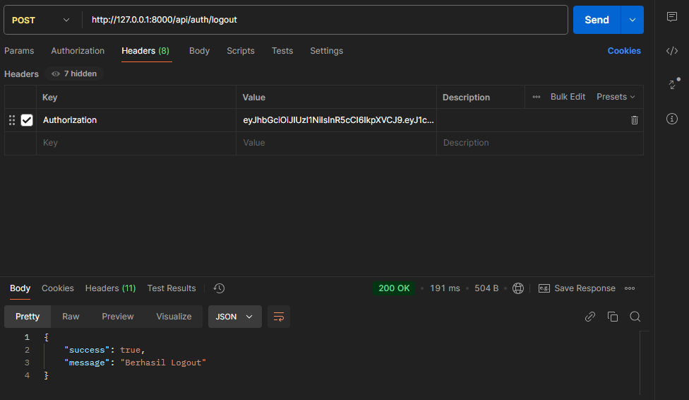

Product_note
1. Create
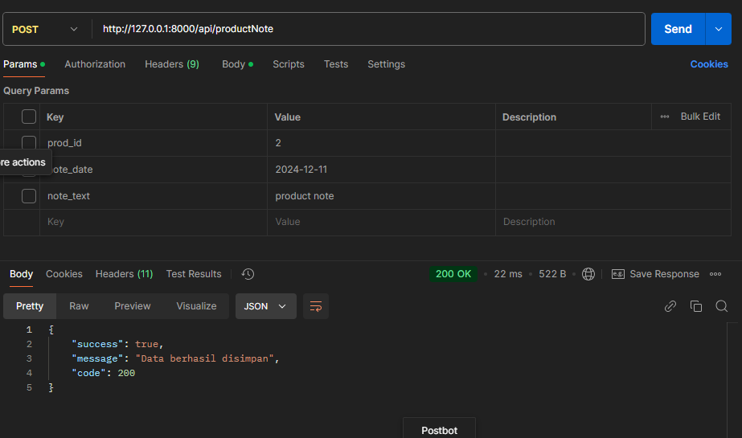
2. Reed
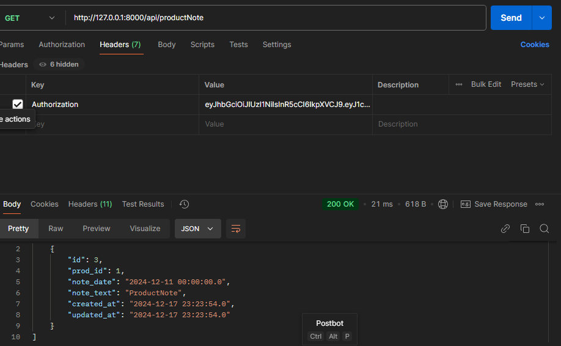
3. Update
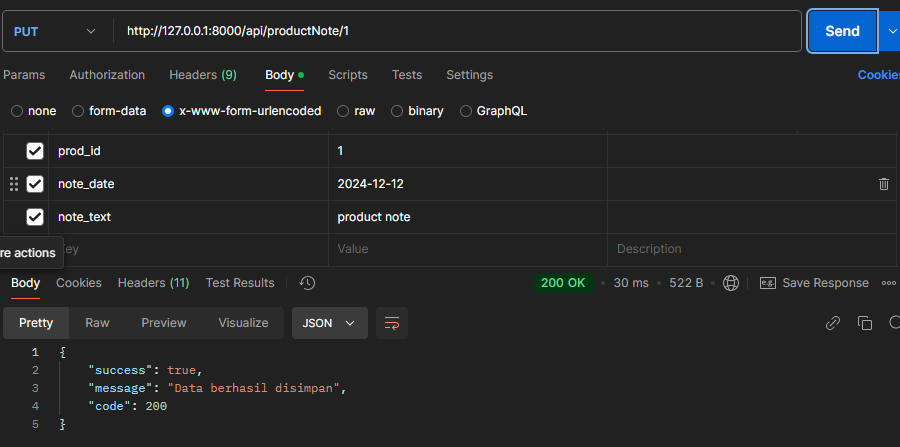
4. Delete
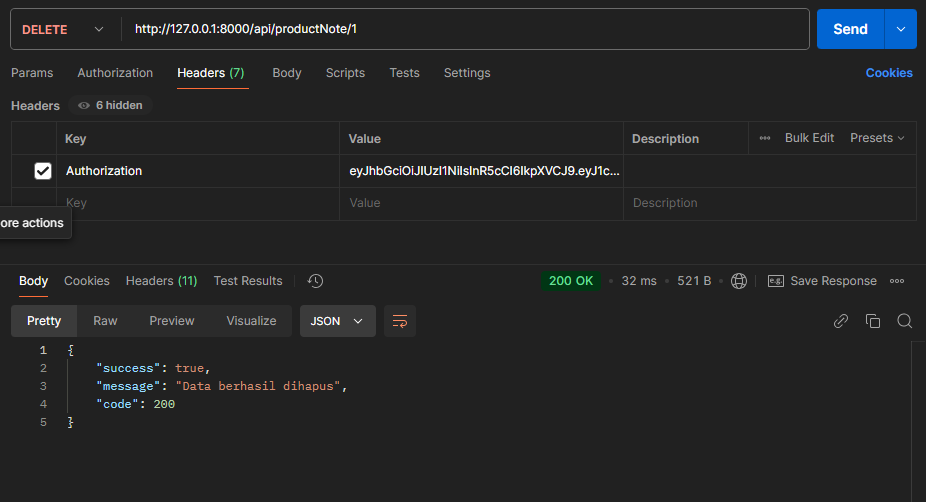

Order
1. Create
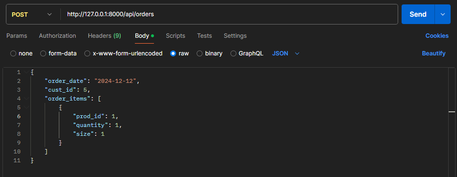
2. Reed
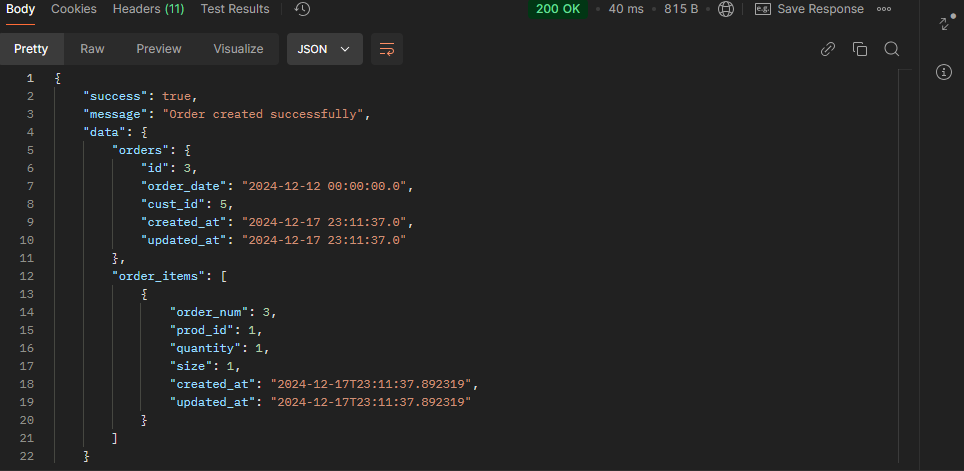
3. Di order tidak memungkin untuk melakukan update
4. Delete
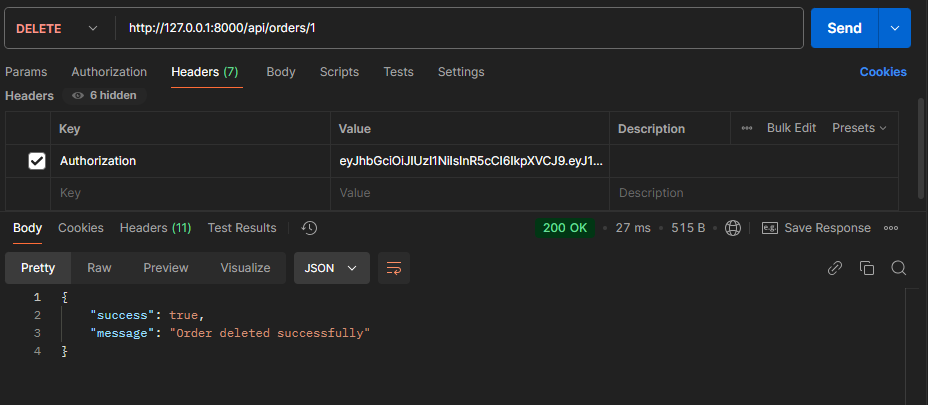